<div align="center">

# parse_video

**短视频解析 · AI 剧本复刻 · 一键成片**

上传一段短视频（或粘贴抖音分享链接），AI 解析出它的剧本结构；换一个主题，自动生成全新的剧情、配音、画面与成片。


[功能特性](#功能特性) · [界面预览](#界面预览) · [快速开始](#快速开始) · [系统架构](#系统架构) · [API 概览](#api-概览) · [已知限制](#已知限制)

</div>

---

## 项目简介

`parse_video` 是一个把「照着别人的短视频做出自己的版本」这件事自动化的 Web 应用。

它做两件事：

1. **解析**：把一段短视频拆成结构化剧本 —— 语音识别出带说话人的台词、逐帧理解画面、按时间戳合并成「分镜表」（每个分镜带镜头描述、景别、台词、画面标签），并总结出视频类型与核心卖点。
2. **复刻**：在解析结果之上输入一个新主题（比如“保留这个反转结构，把卖点从矿泉水换成猫粮”），系统就会沿着 LangGraph 编排的流水线重新生成剧情 → 配音 → 角色/场景图 → 分镜帧 → 分镜视频 → 合成成片，得到一支结构相同、内容全新的视频。

除视频复刻外，还支持**小说转剧本**（长篇小说按章节切分、逐段转成分镜脚本）和**原片直转**（不换内容，直接把解析结果重渲染成新视频）。

---

## 功能特性

- **视频解析** —— 拖拽上传本地视频（≤ 200MB / 3 分钟），或粘贴抖音分享文案自动提取链接下载；解析结果包含 Markdown 分析、JSON 剧情、分镜表与镜头特征标签。
- **AI 剧本复刻** —— 输入复刻主题/风格，可选替换原片中的推广产品；支持手动逐步推进与自动跑完全流程。
- **AI 成片流水线** —— 多角色 TTS 配音（含时长校准与台词压缩）→ 角色/场景基础图 → 分镜帧（多参考图融合）→ 分镜视频（图生视频）→ FFmpeg 合并为成片。
- **小说转剧本** —— 上传或粘贴小说全文，自动识别章节、按章节生成可继续进入流水线的分镜脚本。
- **原片直转** —— 用解析结果一键创建渲染任务，快速验证整条生成链路。
- **素材级重生成** —— 每张图片都可改提示词/换随机种子后单独重生成；剧本内容可导出 Markdown，分镜脚本可导出 JSON。
- **云端 / 本地两种生成方式** —— 图像与视频既可走本地 ComfyUI，也可走云端（RunningHub）工作流；Docker 部署下固定为云端，由 `/clone/capabilities` 接口下发可选比例与默认方式。
- **账号体系与资产隔离** —— 自助注册（默认未激活）、管理员激活后才能生成配音/图片/视频；普通用户只能看到和操作自己的资产，管理员可见全部；删除账号级联清理其名下资产。

---

## 界面预览

### 视频创作工作台

| 解析视频 | 复制剧本 |
|---|---|
| 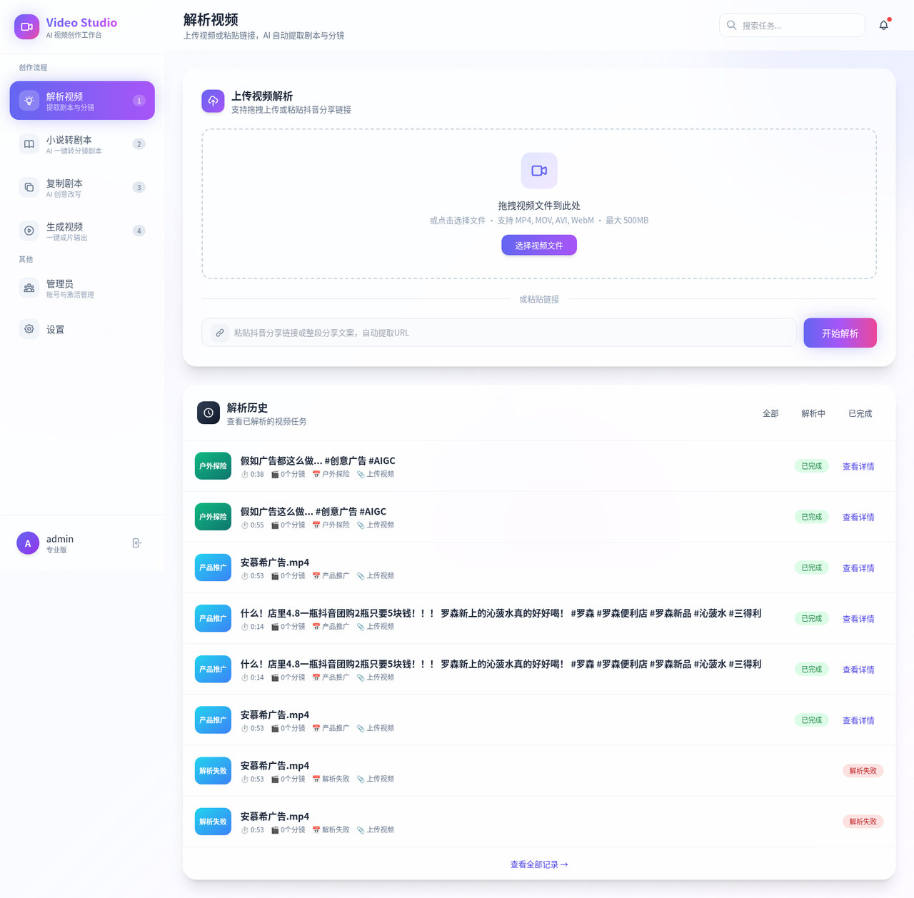 | 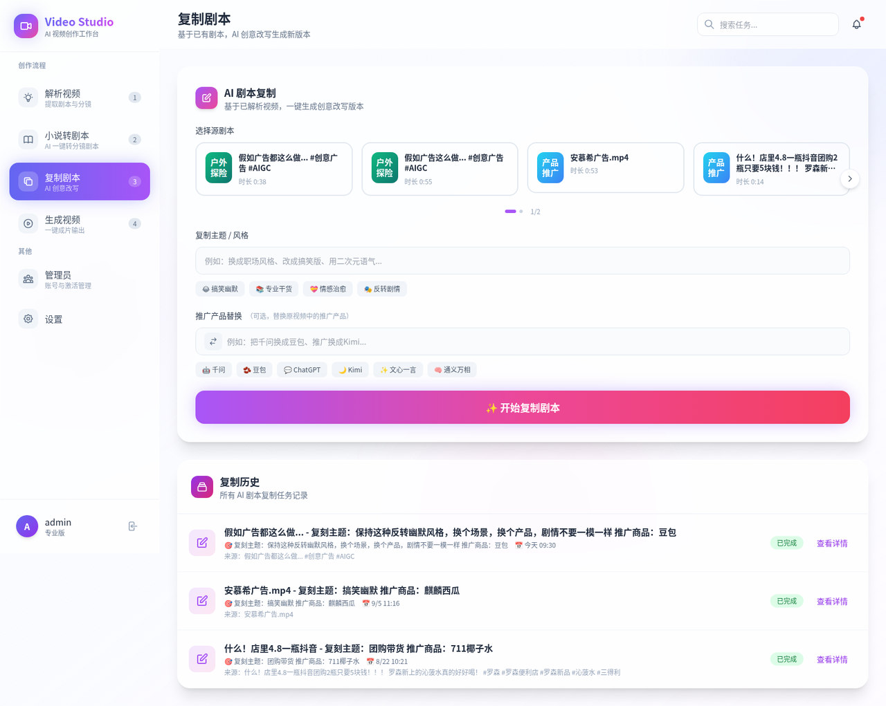 |

| 生成视频 | 小说转剧本 |
|---|---|
| 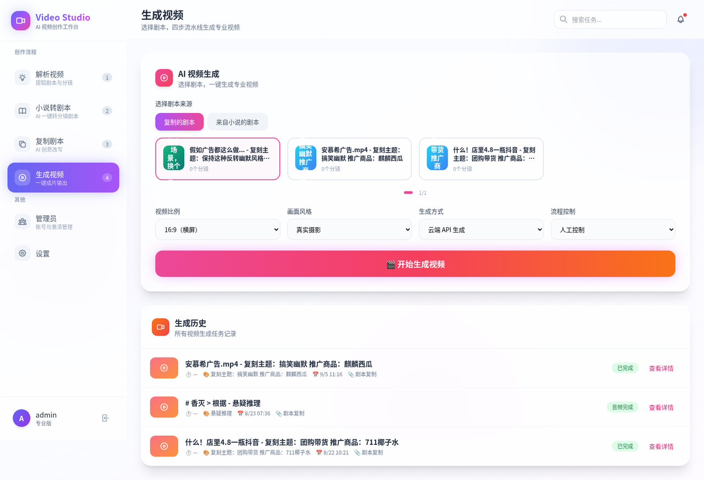 | 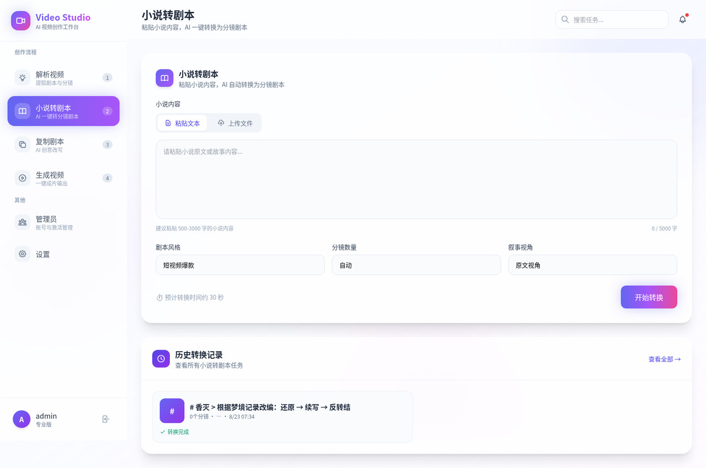 |

### 详情弹窗（剧本内容 / 分镜脚本 / 任务信息）

| 剧本内容 | 分镜脚本 | 任务信息 |
|---|---|---|
| 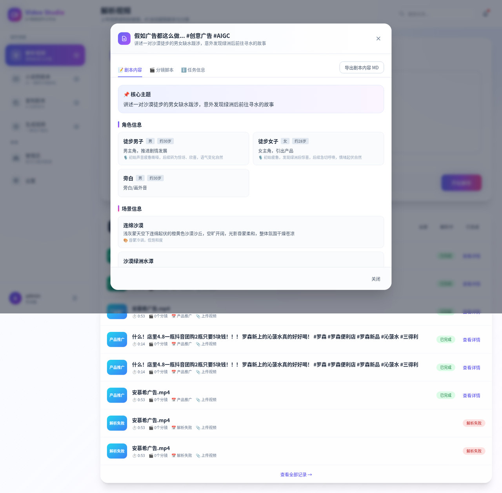 | 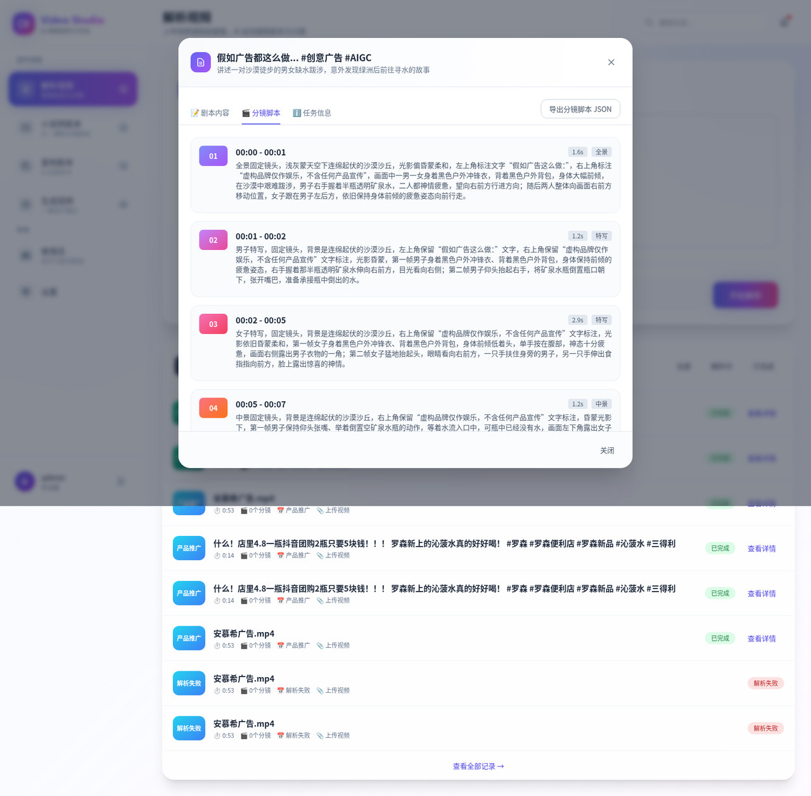 | 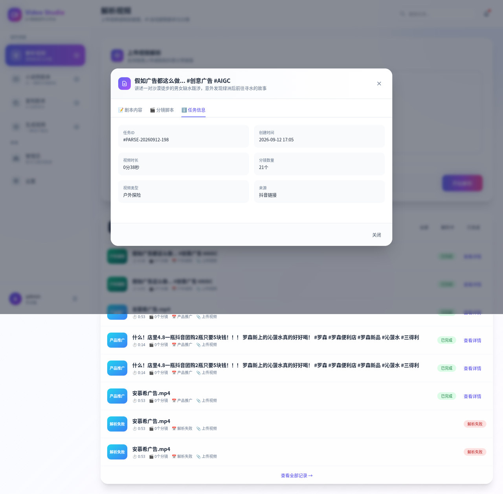 |

### 账号与权限

| 登录 | 管理员 |
|---|---|
| 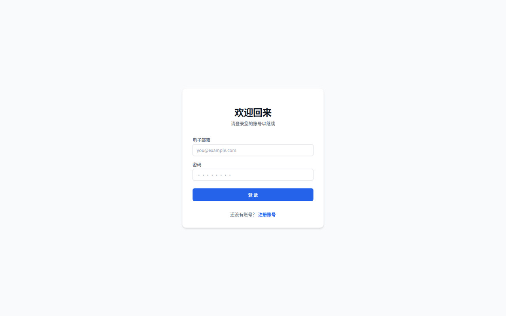 | 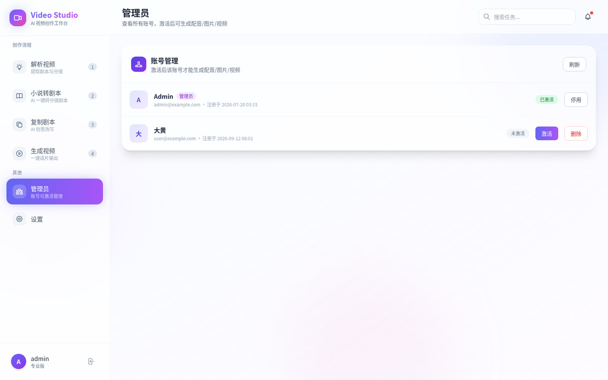 |

---

## 技术栈

| 层级 | 技术 | 说明 |
|---|---|---|
| 前端 | Next.js 14 (App Router) · TypeScript · Tailwind CSS 3 | 单页工作台 + 多标签页交互 |
| 后端 | FastAPI 0.139 · Uvicorn · Pydantic v2 | REST API，全部挂在 `/api/v1` |
| 异步任务 | Celery 5.3（solo pool）· Redis | 解析与复刻在 worker 中异步执行 |
| 数据库 | PostgreSQL 15 · SQLAlchemy 2.0 (async) · Alembic | 异步引擎 + 线性迁移链 |
| AI 编排 | LangGraph（StateGraph）· LangChain | 复刻流水线的多步骤工作流编排 |
| 大模型 | OpenAI 兼容接口（默认火山方舟 doubao 系列） | 剧情、分镜、提示词、画面理解 |
| 语音识别 | 字节跳动 ASR（bigmodel） | 带说话人分离与标点的语音转文本 |
| 语音合成 | 字节跳动 Seed-TTS 2.0 | 多角色 TTS，SSE 流式返回 |
| 图像 / 视频生成 | ComfyUI（本地）或 RunningHub（云端） | 文生图、多参考图融合、图生视频、音频驱动视频 |
| 媒体处理 | FFmpeg / ffprobe · PySceneDetect · pydub | 音频提取、场景分割、音频拼接、视频合并 |
| 机器学习 | scikit-learn | 按说话人预测 TTS 台词时长 |
| 部署 | Docker Compose | 6 个服务一键拉起 |

---

## 系统架构

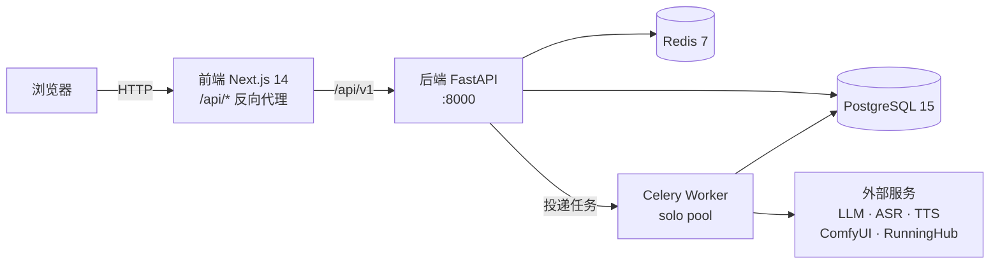

### 服务一览（Docker Compose）

| 服务 | 端口 | 职责 |
|---|---|---|
| `prestart` | — | 一次性初始化：执行 Alembic 迁移、创建管理员账号，结束后退出 |
| `backend` | 8000 | FastAPI 服务，处理全部 HTTP 请求 |
| `celery_worker` | — | 执行解析与复刻任务（solo pool，串行执行） |
| `frontend` | 80 → 3000 | Next.js 服务，并把 `/api/*` 反向代理到 `backend:8000` |
| `postgres` | 5433 → 5432 | 业务数据库 |
| `redis` | 6380 → 6379 | Celery broker + 接口限流计数 |

> 本地开发时 `postgres` 映射到宿主机 **5433**、`redis` 映射到 **6380**，避免和已有服务冲突。

### 两条核心流水线

**① 视频解析**（Celery：`parse_video_task`）

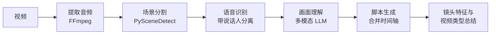

**② 剧本复刻**（Celery + LangGraph：`clone_video_task`）

```
step 1 剧情生成    →  2 分镜生成   →  3 配音   →  4 基础图像
                   →  5 分镜帧     →  6 分镜视频  →  7 合并成片
```

每一步都是独立 LangGraph 子图（或异步函数），节点间通过条件边实现「失败 → 报错节点」「成功 + 自动运行 → 下一步」「成功 + 手动模式 → 结束等待」三种走向。任务通过 `POST /clone/phase` 携带 `step` 推进，也可在创建时让后端一路自动跑到指定阶段。

---

## 目录结构

```
parse_video/
├── backend/                          # FastAPI 后端
│   ├── app/
│   │   ├── api/
│   │   │   ├── router/               # login / user / videos / scripts / clone / novel / render
│   │   │   ├── deps.py               # 认证依赖、Redis 限流器、DB Session
│   │   │   ├── security.py           # 密码哈希（Argon2 + Bcrypt）与 JWT 签发
│   │   │   └── router_main.py        # 公开路由与鉴权路由注册
│   │   ├── models/                   # SQLAlchemy 模型：user / video / script / novel / voice
│   │   ├── schemas/                  # Pydantic 出入参模型
│   │   ├── services/
│   │   │   ├── video_processor.py    # 音频提取 + 场景分割
│   │   │   ├── asr_service.py        # 语音识别
│   │   │   ├── visual_service.py     # 画面理解
│   │   │   ├── script_generator.py   # 脚本生成与镜头特征
│   │   │   ├── clone*.py             # 复刻流水线各阶段
│   │   │   ├── novel*.py             # 小说解析 / 分析 / 转剧本
│   │   │   ├── h3_prompt_optimizer.py# 音驱分镜视频的提示词优化
│   │   │   ├── comfy/                # ComfyUI WebSocket 客户端与工作流模板
│   │   │   └── predict/              # TTS 时长预测模型
│   │   ├── tasks/
│   │   │   ├── parse_video.py        # Celery 任务定义
│   │   │   └── process_loop_manager.py # worker 内常驻事件循环
│   │   ├── prestart/                 # 迁移执行与管理员初始化
│   │   ├── config.py                 # Pydantic Settings 配置
│   │   └── database.py               # 同步 + 异步双引擎
│   ├── alembic/versions/             # 数据库迁移
│   └── tests/                        # pytest 测试
├── frontend/                         # Next.js 14 前端
│   └── src/
│       ├── app/                      # 页面：/ · /login · /register
│       ├── components/video-studio/  # 工作台各标签页与详情弹窗
│       ├── lib/                      # API 封装与导出工具
│       └── middleware.ts             # 登录态守卫
├── docs/                             # 设计文档与截图
├── docker-compose.yml                # 6 服务编排
├── start.sh / stop.sh                # 本地开发启停脚本
└── .env.example                      # 环境变量模板
```

---

## 快速开始

### 前置依赖

- **Docker 版**：Docker + Docker Compose（其余依赖都在镜像里）
- **本地开发**：Python 3.10+、Node.js 18+、FFmpeg，以及 Docker（用于起 PostgreSQL 和 Redis）

### 方式一：Docker Compose（推荐）

```bash
git clone https://github.com/XztCloud/parse_video.git
cd parse_video
cp .env.example .env
```

编辑 `.env` 填写必要配置（数据库密码、`SECRET_KEY`、管理员账号，以及至少一组大模型/语音服务密钥，详见[环境变量](#环境变量)），然后：

```bash
docker compose up -d --build
```

启动完成后访问 **http://localhost**，用 `.env` 中配置的 `SUPER_ADMINI_EMAIL` / `SUPER_ADMINI_PASSWORD` 登录。

> Docker 部署下 `RUN_ENV=PRODUCTION`，后端会关闭 `/docs`、`/redoc` 与 `/openapi.json`，接口文档仅在开发环境可见。

### 方式二：本地开发

**1. 准备配置与基础设施**

```bash
cp .env.example .env                 # 本地开发时 POSTGRES_PORT=5433、REDIS_URL 用 6380
docker compose up -d postgres redis  # 只起 PostgreSQL 与 Redis
```

**2. 启动后端**

```bash
python -m venv .venv && source .venv/bin/activate
pip install -e ./backend             # 安装依赖并注册 start-api / start-worker 等命令

cd backend
alembic upgrade head                 # 建表 / 迁移
create-admin                         # 创建 .env 中配置的管理员账号
start-api                            # 启动 API 服务（开发时可改用 python -m uvicorn app.main:app --reload）
```

**3. 启动 Celery Worker**（另开一个终端）

```bash
source .venv/bin/activate
cd backend && start-worker
```

**4. 启动前端**（另开一个终端）

```bash
echo "API_PROXY_TARGET=http://localhost:8000" > frontend/.env   # 该文件被 gitignore，需手动创建
cd frontend && npm install && npm run dev
```

也可以直接用项目自带的脚本一键启动（后端 + Celery + 前端，但不会创建 `frontend/.env`）：

```bash
bash start.sh     # 启动全部服务
bash stop.sh      # 停止全部服务
```

启动后的地址：

| 服务 | 地址 |
|---|---|
| 前端 | http://localhost:3000 |
| 后端 API | http://localhost:8000/api/v1 |
| 接口文档（仅 `RUN_ENV=DEV`） | http://localhost:8000/docs |

---

## 环境变量

配置集中在根目录 `.env`（模板见 `.env.example`）。常用项：

### 基础配置

| 变量 | 说明 |
|---|---|
| `SECRET_KEY` | JWT 签名密钥，**必填且无默认值** |
| `ACCESS_TOKEN_EXPIRE_MINUTES` | 登录凭证有效时长（分钟），默认 60 |
| `RUN_ENV` | `DEV` 开启接口文档；`PRODUCTION` 关闭文档且禁止选用本地 Comfy |
| `BACKEND_CORS_ORIGINS` | 允许跨域的前端地址列表 |
| `POSTGRES_SERVER` / `POSTGRES_PORT` / `POSTGRES_USER` / `POSTGRES_PASSWORD` / `POSTGRES_DB` | 数据库连接 |
| `REDIS_URL` | Redis 连接串（Celery broker + 限流存储） |
| `SUPER_ADMINI_EMAIL` / `SUPER_ADMINI_PASSWORD` | 首次启动时自动创建的管理员账号 |

### AI 服务

| 变量 | 说明 |
|---|---|
| `LLM_NAME` / `LLM_BASE_URL` / `LLM_API_KEY` | 文本与多模态模型（OpenAI 兼容接口） |
| `BYTEDANCE_APP_ID` / `BYTEDANCE_TOKEN` / `BYTEDANCE_AK` / `BYTEDANCE_SK` / `BYTEDANCE_API_KEY` | 语音识别与语音合成 |
| `IMAGE_MODEL_NAME` / `IMAGE_MODEL_API_KEY` / `IMAGE_MODEL_BASE_URL` | 云端图像生成接口 |
| `STORYBOARD_TRY_COUNT` | 分镜生成的最大重试次数，默认 3 |

### 图像 / 视频生成

| 变量 | 说明 |
|---|---|
| `USE_COMFY_IMAGE` | `True` 用本地 ComfyUI 生成图像 |
| `USE_COMFY_VIDEO` | `True` 用本地 ComfyUI 生成分镜视频；`False` 时走 RunningHub 云端 |
| `COMFY_URL` / `COMFY_USER` / `COMFY_PASSWORD` | 本地 ComfyUI 连接信息 |
| `RUNNINGHUB_API_KEY` | RunningHub 云端工作流密钥 |
| `RUNNINGHUB_H3_VIDEO_APP_ID` / `RUNNINGHUB_H3_VIDEO_INSTANCE_TYPE` | 音频驱动分镜视频所用的云端工作流 |
| `RUNNINGHUB_VIDEO_MAX_WAIT_SECONDS` | 云端视频生成的最长等待时间，默认 600 |
| `DOUYIN_COOKIES_FILE` | 抖音下载所需的 cookies 文件（Netscape 格式） |

### 日志

| 变量 | 说明 |
|---|---|
| `LOG_ENABLED` / `LOG_DIR` / `LOG_LEVEL` | 日志开关、目录与级别 |

---

## 数据模型

```
users
 ├── videos ──1:1── scripts ──1:N── script_segments
 │                    └──1:N── clone_scripts ──┬── clone_voices
 └── novels ──────────────────┘               ├── clone_script_segments ──┬── clone_segment_images
                                              │                           └── clone_segment_videos
                                              ├── clone_role_images
                                              ├── clone_scene_images
                                              └── clone_videos
```

- 归属关系只挂在两个根表 `videos` 与 `novels` 上，复刻相关的子资源通过 `script → video` 或 `novel` 推导所属用户。
- 复刻任务有两套互相独立的状态：
  - `clone_status`：剧本阶段 —— `PENDING → PLOT → PLOT_DONE → SEGMENTS → SEGMENTS_DONE`（或 `FAILED`）
  - `generate_flow_status`：成片阶段 —— `PENDING → VOICE → VOICE_DONE → IMAGE → IMAGE_DONE → FRAME → FRAME_DONE → SEGMENT_VIDEO → SEGMENT_VIDEO_DONE → MERGE_VIDEO → MERGE_VIDEO_DONE`（或 `FAILED`）
- 视频解析状态：`VideoStatus` = `pending / processing / done / failed`。

---

## API 概览

所有接口挂在 `/api/v1` 下，除登录与注册外都需要携带 JWT（`Authorization: Bearer <token>` 或 `access_token` Cookie）。开发环境下可在 `/docs` 查看完整交互式文档。

### 认证与账号

| 方法 | 路径 | 说明 |
|---|---|---|
| POST | `/login/access-token` | 账号密码登录，返回 JWT 并写入 Cookie |
| POST | `/login/logout` | 退出登录，清除 Cookie |
| POST | `/login/test-token` | 校验当前凭证是否有效 |
| POST | `/users` | 注册账号（固定创建为未激活的普通用户） |
| GET | `/users/me` | 当前登录账号信息 |
| GET | `/users` | 账号列表（仅管理员） |
| PATCH | `/users/{user_id}/active` | 激活 / 停用账号（仅管理员） |
| DELETE | `/users/{user_id}` | 删除账号并级联删除其资产（仅管理员） |

### 视频解析

| 方法 | 路径 | 说明 |
|---|---|---|
| POST | `/videos/upload` | 上传视频并触发解析 |
| POST | `/videos/douyin` | 提交抖音链接，下载后触发解析 |
| GET | `/videos` | 视频列表 |
| GET | `/videos/{video_id}/status` | 解析状态与进度 |
| GET | `/scripts/{video_id}` | 解析出的剧本与分镜 |
| GET | `/scripts/{video_id}/export` | 导出解析脚本 |

### 剧本复刻

| 方法 | 路径 | 说明 |
|---|---|---|
| POST | `/clone/plot` | 创建复刻任务并开始生成剧情 |
| POST | `/clone/re_plot` | 重新生成剧情 |
| POST | `/clone/phase` | 推进到指定阶段（`step` 2–7） |
| GET | `/clone/list_all` | 复刻任务列表 |
| GET | `/clone/{script_id}/list_clone_scripts` | 某个脚本下的全部复刻任务 |
| GET | `/clone/{clone_script_id}` | 复刻任务完整详情 |
| GET | `/clone/{clone_script_id}/status` | 复刻任务状态与进度 |
| GET | `/clone/capabilities` | 可选视频比例与生成方式 |
| GET | `/clone/{clone_script_id}/export/plot` | 导出复刻剧本 Markdown |
| PATCH | `/clone/{category}/{id}/regenerate` | 重新生成单张图片 |
| GET | `/clone/{category}/{id}/regenerate` | 查询重生成结果 |
| GET | `/clone/voice/{voice_id}` | 下载配音音频 |
| GET | `/clone/image/{category}/{image_id}` | 获取生成图片 |
| GET | `/clone/video/{category}/{video_id}` | 获取生成的视频 |

### 小说转剧本

| 方法 | 路径 | 说明 |
|---|---|---|
| POST | `/novel/upload` | 上传小说文件 |
| POST | `/novel/create` | 粘贴文本创建小说 |
| POST | `/novel/generate` | 触发小说转剧本 |
| GET | `/novel/list_all` | 小说列表 |
| GET | `/novel/{novel_id}/status` | 处理状态 |
| GET | `/novel/{novel_id}/scripts` | 生成的剧本列表 |

### 原片直转

| 方法 | 路径 | 说明 |
|---|---|---|
| POST | `/render/from-script` | 用解析结果创建渲染任务并跑完整条流水线 |

---

## 账号与权限

- 自助注册的账号默认 **未激活**，需管理员在「管理员」页激活后才能生成配音 / 图片 / 视频 / 成片；未激活时点击生成会给出明确提示。
- 普通用户只能查看和操作自己创建的资产；管理员（`is_superuser=True`）可以查看与操作全部资产。
- 上传视频、上传小说、创建复刻剧本、生成分镜等操作不受激活状态限制。
- 删除账号会级联删除其名下的视频、脚本、复刻任务及其全部子资源，操作不可恢复。
- 上传与复刻类接口按「用户 + 路径」限流（5 秒 1 次），基于 Redis 实现。

---

## 测试

测试位于 `backend/tests/`，基于 pytest（配置见 `backend/pyproject.toml`，按 `auth / api / crud / worker / ddt` 分组标记）。

```bash
cd backend
pip install pytest pytest-asyncio responses-validator jsonpath pyyaml
pytest                                   # 运行全部测试
pytest tests/tests/api -m api            # 只跑接口测试
pytest -m worker                         # 只跑 worker 相关测试
```

> `pyproject.toml` 里的 `dev` 依赖组目前含有一条无法解析的依赖（`httpx2=2.7.0`），因此暂不能用 `pip install --group dev` 安装，请按上面的命令手动安装测试依赖。

> ⚠️ 接口测试会连接 `.env` 中配置的数据库，且 `conftest.py` 里「会话结束清空 `Video` / `User` / `VoiceInfoCollect` 表」的夹具默认处于注释状态。请在独立的测试库上运行，不要在存放真实资产的库上跑。
>
> 分镜生成等耗时的 Celery 任务在测试中通过 `mock_parse_video_task` / `mock_clone_video_task` 打桩，不会真正入队。

---

## 已知限制

- **分镜视频目前只处理第一个分镜**：`clone_segment_video.py` 中保留了联调用的 `if i > 0: continue`，生产前需放开。
- **分镜帧生成只支持本地 ComfyUI**：角色 + 场景多参考图融合尚未接入云端工作流。
- **前端历史列表的「分镜数」显示为 0**：列表接口暂未返回该字段，详情页中的数据是准确的。
- **上传大小提示不一致**：前端文案写的是 500MB，后端实际限制为 **200MB / 3 分钟**。
- **临时文件不自动清理**：音频、场景切片、帧图等中间产物会持续累积。
- **进度基于轮询**：前端按固定间隔轮询状态接口，长耗时阶段进度会停留较久。
- **`/docs` 在生产环境关闭**：Docker 部署下无法访问接口文档，需临时切回 `RUN_ENV=DEV`。

---

## 相关文档

- [H3 提示词优化说明](docs/h3_prompt_optimize.md) —— 音驱分镜视频的提示词构造与节点映射
- [小说转剧本接口测试指南](docs/novel_api_test_guide.md)
- [小说转剧本测试结果](docs/novel_to_script_test_results.md)

---

## 许可证

本项目基于 [MIT 许可证](LICENSE) 开源，你可以自由使用、修改、分发甚至用于商业闭源项目，只需保留原始的版权与许可声明。

需要注意：许可证只覆盖本仓库的代码。项目运行时会调用第三方模型与 API（大模型、语音识别/合成、ComfyUI、RunningHub 等），使用它们产生的费用与合规要求由使用者自行承担。
